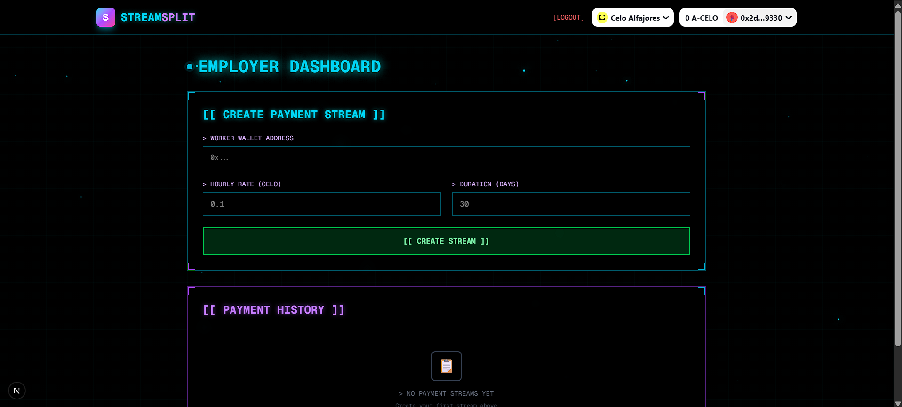
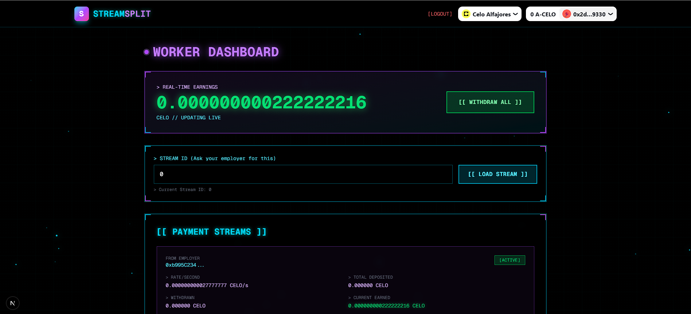
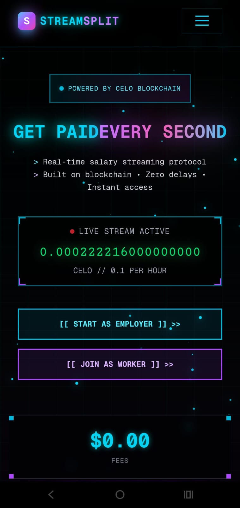

# StreamSplit

Real-time salary streaming dApp on Celo — stream payments per second. Built as a PWA with employer and worker dashboards for live payroll management and instant withdrawals.

---

## 🚀 Live

- **Frontend:** https://stream-split.vercel.app
- **Contract (Alfajores testnet):** `0x28f8aE58a76aEe9024e4a823af429831c6173029`

---

## ✨ What it does (short)

- Employers create continuous payment streams (set rate, duration, deposit).
- Workers see earnings update every second and can withdraw instantly.
- Stream controls: pause, resume, stop, and add funds.
- Secure Solidity implementation (Ownable, Pausable, ReentrancyGuard).

---

## 🖼 Screenshots (included)

Employer dashboard — create/manage streams



Worker dashboard — live earnings and withdraw



Mobile / PWA view



---

## 🛠 Tech (short)

- Next.js 16 + React 19 + TypeScript 5
- Tailwind CSS 4, RainbowKit, Wagmi, Viem
- Solidity 0.8.28, Hardhat, Celo (Alfajores)

---

## ⚡ Quick Start (hackathon-ready)

Clone, install, run the frontend:

```powershell
git clone https://github.com/Debsmit16/Stream-split.git
cd Stream-split\packages\react-app
npm install
npm run dev
```

Visit http://localhost:3000

To compile/deploy contracts (inside `packages/hardhat`):

```powershell
cd packages\hardhat
npx hardhat compile
npx hardhat run scripts/deploy.ts --network alfajores
```

---

## 🧾 Hackathon pitch (1–2 lines)

StreamSplit modernizes payroll by turning salary into a continuous, verifiable stream. It reduces payroll friction, improves worker cash flow, and demonstrates a mobile-first, blockchain-native payroll UX.

---

## 📄 License

MIT

# StreamSplit


---

## 🚀 Deployment

- **Live App:** [https://stream-split.vercel.app](https://stream-split.vercel.app)
- **Smart Contract (Alfajores Testnet):** `0x28f8aE58a76aEe9024e4a823af429831c6173029`

---

## ✨ Main Functionalities

- Create, pause, resume, stop, and top-up salary streams (Employer dashboard)
- Real-time earnings and instant withdrawals (Worker dashboard)
- PWA: installable, offline support, mobile-first responsive UI
- Secure smart contract (Ownable, Pausable, ReentrancyGuard)

---

## 🛠️ Tech Stack

- Next.js 16, React 19, TypeScript 5
- Tailwind CSS 4, RainbowKit, Wagmi, Viem
- Solidity 0.8.28, Hardhat, Celo Alfajores

---

## � Quick Start

```bash
git clone https://github.com/Debsmit16/Stream-split.git
cd Stream-split/packages/react-app
npm install
npm run dev
```

---

## 📄 License

MIT
- **Language**: TypeScript 5
